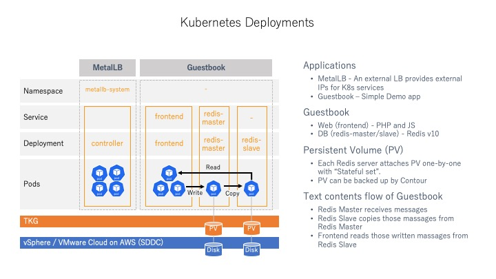
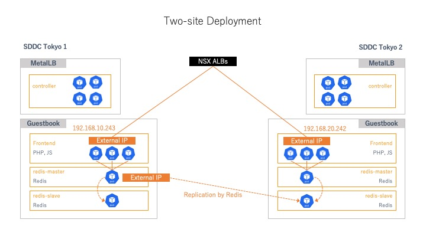

# PHP Guestbook with Redis - customized
This is an example guestbook application with PHP and Redis running on Kubernetes cluster. This repo intends to perform a demonstration or practice of operation on Kubernetes environment.

## Description
If you deploy the guestbook application on the two site, written massage data can be replicated between both sites.

### Deployment
Idias of the deployment is shown below.

## Requirement
- Tanzu Kubernetes Grid

## Usage
### Initial deployment
1. Deploy MetalLB on both sites.
2. Deploy Guestbook application on both site.
3. Change the replication target of Redis-slave server on the fialover site from Redis-master to the Redis-master on the production site.

### Failover
1. Stop the frontend service on the production site.
2. Change the replication target of Redis-slave server on the failover site from Redis-master on the production site to the failover (local) site.

## Clean up
1. Delete Guestbook application.
2. Delete MetalLB.

## Author
nao-yoshi
